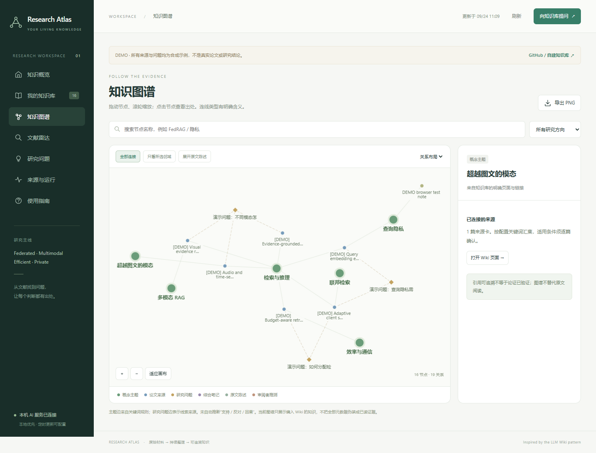

# Research Atlas：让读过的论文成为可追溯的知识

[English](README.md) · [在线只读演示](https://dsd12356994.github.io/research-atlas/) · [详细使用说明](docs/QUICKSTART.md)

本地运行的文献与知识工作台：持续收集论文、记录真实阅读范围、整理 Markdown Wiki，用交互图谱连接来源、概念、问题与保存的问答。参考 Karpathy 的 LLM Wiki 思路，以原始材料、持久化知识和维护约定三层组织。



## 解决什么实际麻烦

- 论文收藏很多，却分不清哪些只是元数据、哪些读过部分原文。
- 有用的问答散落在聊天里，之后找不到依据，也不知道来源是否更新。
- 图谱看起来复杂，却无法解释一条连线究竟代表什么。

这里将这些状态分开保存：来源卡保留阅读范围，回答引用输入页面，图谱连线有明确类型，来源变化会提示旧综合笔记需要复核。编译时保留人工编辑。

## 五分钟尝试

需要 Python 3.10+。克隆后在项目根目录运行：

```powershell
python -m venv .venv
.\.venv\Scripts\python.exe -m pip install -r requirements.txt
.\.venv\Scripts\python.exe -m hub.setup --demo
.\.venv\Scripts\python.exe -m hub.server --port 8767
```

打开 http://127.0.0.1:8767 。日后可双击 `Open-Research-Atlas.cmd`。**演示不需要 API key，不会调用模型；演示论文全部是虚构的界面测试材料。**

建立自己的真实资料库，请在另一个干净目录克隆，运行 `python -m hub.setup`，省略 `--demo`。演示初始化不会覆盖已有资料。配置与命令见[详细指南](docs/QUICKSTART.md)。

## 你可以怎样使用

1. 在“文献雷达”找具体场景，检查来源采集状态。
2. 在“我的知识库”阅读来源卡，或添加自己的 Markdown/txt 笔记。
3. 在“知识图谱”按方向筛选、沿来源与问题浏览，查看反向链接。
4. 配置自己的模型服务后提问；回答校验引用身份后保存为草稿。
5. 关键判断仍回到原文复核，再交给实验规划。

它与 [research_agent](https://github.com/dsd12356994/research_agent) 的分工是：Research Atlas 管持续积累的文献知识；research_agent 管某个研究项目的假设、实验和论文流程。目前通过 Markdown 与来源链接手动衔接，尚未声称自动集成。

## 当前能力边界

UI 与生成笔记以中文为主，技术名称保留英文。不是完整 GraphRAG 或自动科研系统；不自动确认研究空白，不保证全网论文没有遗漏。部分阅读不代表全文精读，引用存在也不证明推论正确。

资料本地保存；调用远程模型时，会将选中的来源摘录发送给你配置的服务。密钥、个人资料库和模型输出默认被 Git 忽略。公开版没有携带维护者的论文库、实验结果、个人笔记或模型配置。

如果确实帮到了你，欢迎 Star 或提交可复现的问题。项目仍是早期公开预览，优先欢迎英文 UI、覆盖检查与导入体验方面的贡献。
