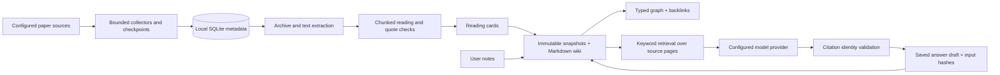

# Architecture

The wiki compiler is deterministic. It creates source/topic/question pages and preserves files modified since their last generated hash. AI synthesis is explicit, with immutable input excerpts and completion output records. Generated answers and syntheses are excluded from the answer retrieval evidence set to avoid circular self-citation.

`hub/store.py` manages identity and SQLite state. `harvest.py` and `acquisition.py` handle paginated sources. `content.py` archives downloads and extracts text; `reader.py` consumes chunks. `wiki.py` implements compile/search/ingest/query/lint. `export.py` writes portable artifacts. `server.py` is a loopback-only bridge; `web/` is a build-free UI.

The graph stores topic associations, hypothesis source links, explicit wiki links and within-source statements. It does not infer semantic support, contradiction or novelty. Queries use SQLite FTS5 keyword retrieval over wiki excerpts, not a multi-hop graph reasoning engine.

## Local state is separate from software

Ignored runtime directories include `data/`, `knowledge/raw/`, `knowledge/wiki/`, `knowledge/.state/`, `knowledge/.history/`, `reports/`, `vault/`, `output/`, `qa/`, and `backups/`. `knowledge/SCHEMA.md` is the tracked maintenance contract. The public repository contains a deliberately synthetic demo dataset; no personal working library is bundled.

Single-user HTTP endpoints are allowlisted. Mutation requests require a same-origin request and a per-process token; the key stays on the Python side. These protections are not a substitute for authentication on a public deployment. Keep it bound to loopback.
